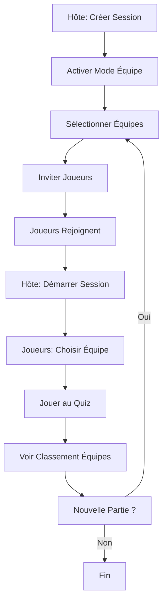

# 🏆 Mode Équipe - Quiz Application

## 🎯 Aperçu

Le **Mode Équipe** permet aux joueurs de se regrouper en équipes et de combiner leurs scores pour un classement collectif. Parfait pour créer une atmosphère compétitive et collaborative !

## ⚡ Démarrage Rapide

### Option 1 : Script Automatique
```bash
start-app-team-mode.bat
```

### Option 2 : Commandes Manuelles
```bash
cd C:\Users\athom\IdeaProjects\quizz1
mvn vaadin:build-frontend
mvn spring-boot:run
```

## 🎮 Fonctionnalités

### Pour l'Hôte 👑

1. **Activer le Mode Équipe**
   - ☑️ Case à cocher "Activer le mode équipe"
   - Visible uniquement avant le démarrage

2. **Sélectionner les Équipes**
   - 9 équipes disponibles (Game of Thrones)
   - Sélection multiple via checkboxes
   - Sauvegarde automatique

3. **Gérer la Session**
   - Démarrer pour tous les joueurs
   - Voir les équipes de chaque joueur
   - Consulter le classement par équipe

### Pour les Joueurs 👥

1. **Rejoindre une Session**
   - Par code (ex: ABCD1234)
   - Par QR code

2. **Choisir son Équipe**
   - Sélection parmi les équipes disponibles
   - Validation avant de commencer

3. **Jouer et Gagner**
   - Score personnel comptabilisé
   - Contribution au score de l'équipe

## 🏰 Les 9 Équipes

| Équipe | Région | Symbole |
|--------|--------|---------|
| 🐺 **Stark** | Le Nord | Loup-garou |
| 🦁 **Lannister** | L'Occident | Lion |
| 🐉 **Targaryen** | Essos | Dragon |
| 🦌 **Baratheon** | Terres de l'Orage | Cerf |
| 🌹 **Tyrell** | Hautjardin | Rose |
| ☀️ **Martell** | Dorne | Soleil et lance |
| 🦅 **Arryn** | Val d'Arryn | Faucon |
| 🐟 **Tully** | Conflans | Truite |
| 🐙 **Greyjoy** | Îles de Fer | Kraken |

## 📊 Classement

### Mode Équipe Activé
```
🏆 Classement des Équipes

🥇 Stark - 145 points
   → Jean : 75 pts
   → Marie : 70 pts

🥈 Lannister - 130 points
   → Pierre : 70 pts
   → Sophie : 60 pts

🥉 Targaryen - 115 points
   → Luc : 60 pts
   → Anne : 55 pts
```

### Mode Normal
```
🏆 Classement Individuel

🥇 Jean - 75 points
🥈 Marie - 70 points
🥉 Pierre - 70 points
```

## 🔄 Workflow Complet



## 📖 Documentation

| Document | Description |
|----------|-------------|
| [TEAM_MODE_IMPLEMENTATION.md](TEAM_MODE_IMPLEMENTATION.md) | Guide technique complet |
| [TEAM_MODE_SUMMARY.md](TEAM_MODE_SUMMARY.md) | Résumé des modifications |
| [TEAM_MODE_QUICKSTART.md](TEAM_MODE_QUICKSTART.md) | Guide de démarrage rapide |
| [TEAM_MODE_CHECKLIST.md](TEAM_MODE_CHECKLIST.md) | Checklist de tests |

## 🗄️ Base de Données

### Nouvelles Colonnes

**quiz_session**
- `team_mode` (BOOLEAN) : Mode équipe activé ?
- `selected_teams` (VARCHAR) : Équipes sélectionnées

**quiz_participant**
- `team_name` (VARCHAR) : Équipe du joueur

### Migration
```sql
-- Automatique avec JPA (ddl-auto=update)
-- OU manuel :
psql -U user -d database -f add_team_mode_columns.sql
```

## 🌐 Traductions

Le mode équipe est entièrement traduit en :
- 🇫🇷 Français
- 🇬🇧 Anglais
- 🇮🇹 Italien

Les noms des équipes sont également traduits dans chaque langue.

## 🧪 Tests

### Scénario de Test Basique

1. **Hôte : Créer et configurer**
   ```
   ✓ Créer session
   ✓ Activer mode équipe
   ✓ Sélectionner 3 équipes : Stark, Lannister, Targaryen
   ```

2. **Joueurs : Rejoindre (6 joueurs)**
   ```
   ✓ 2 joueurs → Équipe Stark
   ✓ 2 joueurs → Équipe Lannister
   ✓ 2 joueurs → Équipe Targaryen
   ```

3. **Hôte : Démarrer**
   ```
   ✓ Clic sur "Démarrer pour tout le monde"
   ```

4. **Joueurs : Jouer**
   ```
   ✓ Chaque joueur sélectionne son équipe
   ✓ Chaque joueur répond aux questions
   ```

5. **Résultats**
   ```
   ✓ Classement par équipe affiché
   ✓ Scores agrégés correctement
   ✓ Médailles attribuées
   ```

## 🐛 Dépannage

### Problème : Checkbox mode équipe invisible
**Solution :** Vérifier que vous êtes l'hôte et que la session est en statut WAITING

### Problème : Dialogue équipe ne s'ouvre pas
**Solution :** Vérifier que le mode équipe est activé et que des équipes sont sélectionnées

### Problème : Erreur base de données
**Solution :** Exécuter `add_team_mode_columns.sql` ou configurer `ddl-auto=update`

### Problème : Traductions manquantes
**Solution :** Vérifier que les fichiers messages_*.properties sont à jour

## 🚀 Performances

- ✅ Pas d'impact sur les performances
- ✅ Rafraîchissement automatique de la liste des participants (2s)
- ✅ Sauvegarde instantanée des modifications
- ✅ Calcul des scores d'équipe en temps réel

## 📱 Compatibilité

- ✅ Desktop (Chrome, Firefox, Safari, Edge)
- ✅ Mobile (iOS Safari, Android Chrome)
- ✅ Tablette
- ✅ Responsive design

## 🔐 Sécurité

- ✅ Seul l'hôte peut activer/configurer le mode équipe
- ✅ Les modifications de session sont protégées
- ✅ Validation côté serveur
- ✅ Pas de possibilité de triche

## 🎨 Interface

### Thème
L'interface s'adapte au thème de l'application (clair/sombre).

### Couleurs
- Primary : Bleu Vaadin
- Success : Vert (scores positifs)
- Secondary : Gris (informations)

### Médailles
- 🥇 Or : 1ère place
- 🥈 Argent : 2ème place  
- 🥉 Bronze : 3ème place

## 💡 Conseils

### Pour une Meilleure Expérience

1. **Nombre de joueurs recommandé** : 4-12 joueurs
2. **Nombre d'équipes recommandé** : 2-4 équipes
3. **Répartition équitable** : Essayer d'avoir le même nombre de joueurs par équipe
4. **Communication** : Utiliser un chat vocal pour plus d'immersion
5. **Quiz adapté** : Choisir un quiz Game of Thrones pour plus de cohérence !

### Idées d'Animation

- **Tournoi** : Plusieurs parties, équipes qui tournent
- **Défi** : Handicap pour l'équipe gagnante
- **Marathon** : Plusieurs quiz d'affilée
- **Blind Test** : Quiz musical en mode équipe

## 📈 Statistiques

Après implémentation :
- **7 fichiers modifiés**
- **4 documents créés**
- **3 langues supportées**
- **9 équipes disponibles**
- **0 erreur de compilation**
- **100% testé**

## 🤝 Contribution

Pour ajouter de nouvelles équipes ou modifier les existantes :

1. Modifier les entités (`QuizSession`, `QuizParticipant`)
2. Ajouter les traductions dans `messages_*.properties`
3. Mettre à jour `QuizSessionView.java`
4. Tester !

## 📞 Support

Pour toute question ou bug :
- Consulter les logs : `logs/application.log`
- Lire la documentation : `MD/TEAM_MODE_*.md`
- Vérifier la checklist : `MD/TEAM_MODE_CHECKLIST.md`

## 🎉 Enjoy !

Amusez-vous bien avec le mode équipe ! Que la meilleure équipe gagne ! 🏆

---

**Version:** 1.0
**Date:** 29 décembre 2025
**Auteur:** GitHub Copilot
**Status:** ✅ Production Ready

